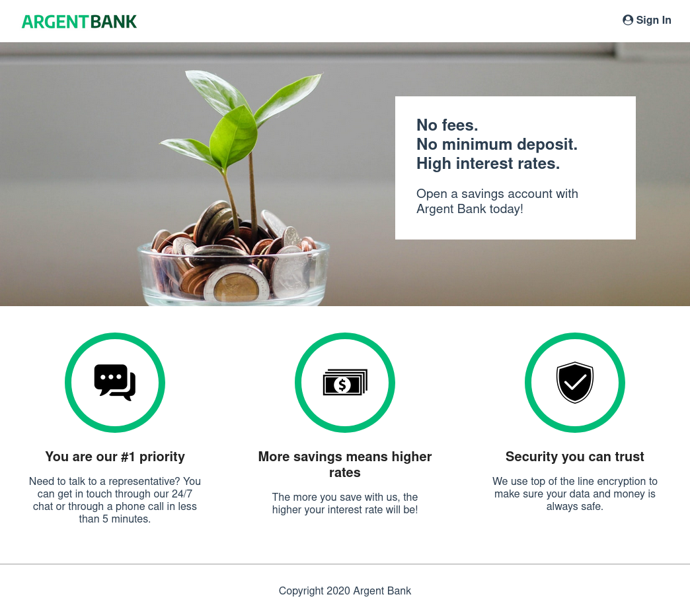

# Argent Bank : account and profile login and management

**Dependencies**

&nbsp;&nbsp;
&nbsp;&nbsp;
&nbsp;&nbsp;
&nbsp;&nbsp;
&nbsp;&nbsp;
&nbsp;&nbsp;

**devDependencies**

&nbsp;&nbsp;

Argent Bank is an application for account and profile login and management

## Getting Started

### Launching the project

1. Fork the repository
2. Clone it on your computer
3. For using api data: 
    * From home directory, open a terminal and run: `cd API/`
    * Install the dependencies with `npm install` or `yarn install`
    * Start local dev server with `npm run dev:server`
    * Populate database with two users with `npm run populate-db`
4. For using app:
   * From home directory, open the terminal and run: `cd Front/`
   * Install the dependencies with `npm install` or `yarn install`
   * Then run `npm start` or `yarn start` (starts the app), App should start on port 3000 ([http://localhost:3000](http://localhost:3000)).

## Populated Database Data

Once you run the `populate-db` script, you should have two users in your database:

### Tony Stark

- First Name: `Tony`
- Last Name: `Stark`
- Email: `tony@stark.com`
- Password: `password123`

### Steve Rogers

- First Name: `Steve`,
- Last Name: `Rogers`,
- Email: `steve@rogers.com`,
- Password: `password456`